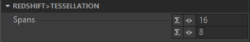

{#mainpage}

# Introduction

R2C (which stands for *your Renderer to Clarisse*) is a helper library designed to simplify the work of 3rd party developers that need to tightly integrate an external rendering engine into Clarisse. R2C provides a few specialized helper classes that are largely inspired from the scene and render delegate design pattern introduced by Pixar in USD Imaging Library (Hydra). It delivers a simplified API hiding the complexity of  scene item and their life-cycle/resource data management as well as render output buffers and interactive rendering.

> **Note:** R2C has been entirely built using the standard SDK shipped with Clarisse. It was exclusively written outside Clarisse's development trunk and there was no secret API involved :-)
> In other words **any** 3rd party developers experienced with Clarisse API would have been able to write R2C!

R2C is really reducing the learning curve of Clarisse API to 3rd party developers that have no or very little experience in Clarisse. Using R2C they can quickly focus on translating Clarisse's scenes and geometry structures into their renderers instead of spending time learning the intricacies of Clarisse API.

> **Important:** The R2C library is still at its early stage. It comes with a few limitations that can be easily lifted which are listed in the limitations section.

# Package Description

R2C package is an external module that is not (yet) part of the standard SDK of Clarisse. It comes with a fully doxygen style documented source code as well as cmake files to build the library. In the package, you'll  also find a working example of a non-feature complete integration of Redshift renderer in Clarisse.

We strongly recommend you to use this example as reference when integrating your renderer into Clarisse. It comes with a full documentation and can even be compiled and run provided you have access to a license of Redshift and its Redshift SDK.

R2C library source code can be found in `r2c` directory.

# Using the R2C API

As mentioned in the introduction, R2C API is largely inspired by the scene and render delegates design pattern introduced by Pixar in their USD Imaging Library.

The way R2C API works is that you have to provide an implementation of your renderer by deriving from the abstract *R2cRenderDelegate* class. The class has to be associated to an instance of a *R2cSceneDelegate*. The *R2cSceneDelegate* defines and manages internally a full Clarisse render scene. It also drives the render delegate according to the updates of the scene.

## Clarisse Object Model Framework

If you don't have any experience of Clarisse API, we highly advise you to read the following articles:
- [**Introduction to Clarisse Object Model**](https://www.clarissewiki.com/4.0/sdk/of_intro.html)
- [**Introduction to Clarisse Modules**](https://www.clarissewiki.com/4.0/sdk/declaring_modules.html)
- [**Introduction to Clarisse Interface Definition**](https://www.clarissewiki.com/4.0/sdk/cid_intro.html)

These articles describe fundamental concepts of Clarisse you need to understand before going any further.

## R2cSceneDelegate the Render Scene Hub

The scene delegate manages a render scene defined by a camera, a render settings (which must inherit from the *OfClass* *Renderer*), a set of lights and a set of geometries inputs which can be easily set through its class members. The *R2cSceneDelegate* acts a render scene hub by notifying the associated render delegate what happens in the scene. In fact, each time an input or its dependencies are modified by the user in Clarisse, the render delegate gets a notification so that it can update its own internal scene representation accordingly.

### Types of scene updates

There are a 3 distinct types of scene updates the scene delegate propagates to the render delegate:
- geometry modifications
- instancer modifications
- lights modifications

For each of these updates, items can be either be inserted, removed or modified in such way that:
- when an item is inserted into the scene, the scene delegate calls *R2cRenderDelegate::insert*.
- when an item is removed from the scene, it calls *R2cRenderDelegate::remove*
- when an item is modified it calls *R2cRenderDelegate::dirty*

Since it is very likely that the render delegate needs to do specific operations for geometries, instancers and lights, the render delegate interface specializes these methods for each type of items:
```cpp
class R2C_EXPORT R2cRenderDelegate : public CoreBaseObject {
/*...*/
    virtual void insert_geometry(R2cItemDescriptor item) = 0;
    virtual void remove_geometry(R2cItemDescriptor item) = 0;
    virtual void dirty_geometry(R2cItemDescriptor item, const int& dirtiness) = 0;

    virtual void insert_light(R2cItemDescriptor item) = 0;
    virtual void remove_light(R2cItemDescriptor item) = 0;
    virtual void dirty_light(R2cItemDescriptor item, const int& dirtiness) = 0;

    virtual void insert_instancer(R2cItemDescriptor item) = 0;
    virtual void remove_instancer(R2cItemDescriptor item) = 0;
    virtual void dirty_instancer(R2cItemDescriptor item, const int& dirtiness) = 0;
/*...*/
```
### Getting item information from the Scene Delegate

The scene delegate can always be accessed by the render delegate. As a matter of fact they always work in tandem.  Actually when creating a scene delegate, you must associate it with a render delegate using *R2cSceneDelegate::set_render_delegate* in order to be notified. Since they have such a close relationship, they both store back pointers to each other respectively.
> **Note:** It is possible to set a render delegate after the scene delegate has been populated.  In that case, the render delegate still gets properly synchronized. In the same way, it is possible to remove a render delegate from a scene delegate by passing a *nullptr* to *R2cSceneDelegate::set_render_delegate*. When doing so, the scene delegate automatically calls *R2cRenderDelegate::clear*.

#### Item descriptors, IDs and good practice

Each time the scene delegate notifies the render delegate from a scene update, it passes a *R2cItemDescriptor*. describing a unique item of the scene.  Depending on the context, this id can identify a geometry, an instancer, a light, a material etc. The *R2cItemDescriptor* class actually abstracts an *OfObject* which can be easily retrieved using *R2cItemDescriptor::get_item*. The reason why R2C API introduces this abstraction is to simplify the work of the renderer plugin writers.

> However, we do not recommend you to store *R2cItemDescriptor*. **Their life cycle should be considered valid only within the call of a method in the render delegate.**

The good practice is to store *R2cItemId* which are ids identifying a unique item of the scene. They can be easily obtained using *R2cItemDescriptor::get_id*. These ids can be used in hash maps etc...

> To get an item descriptor back from an id you just have to use *R2cSceneDelegate::get_render_item*.

Indeed, unlike *OfObject*, using *R2cSceneDelegate* you can retrieve an new *R2cItemDescriptor* and check the validity of the underlying item since it is managed by the scene delegate. That way it is possible to use *R2cItemDescriptor::is_destroyed* to detect if the item has been destroyed. Even when it is destroyed, you can still get its full name, type etc. However, *R2cItemDescriptor::get_item* will return as expected a *nullptr*. For more information, please refer to the documentation.

> **Important:** When *R2cRenderDelegate::remove* methods are called, it is possible that *R2cItemDescriptor* passed as argument may have been already destroyed! Make sure to check *R2cItemDescriptor::is_destroyed*

The good practice is to store/use ids in dedicated lists in the implementation of inserted and removed items. The idea is to make sure the operation is performed as quickly as possible to keep the application interactive. The actual operation of insertion/conversion/removal should be only done when *R2cRenderDelegate::render* is actually called. Obviously, in some cases it can make sense to free memory as soon as possible when getting notified that an item allocating a large chunk of memory is removed from the scene.

## R2cRenderBuffer

The *R2cRenderBuffer* is an abstract class that manages Clarisse render buffers. It is used to pass the actual rendered images and AOVs to Clarisse. The interface is pretty straight forward and we invite you to refer to the documentation for more information.

The R2C library currently provide only one implementation *ClarisseLayerRenderBuffer* which is specialized to fill the render buffer of a ImageLayer.

## Exposing Material and Texture Network

Shader integration in Clarisse can be done in two ways, either by inheriting from the class ModuleMaterial for materials, or by inheriting from the class ModuleTextureOperator for textures. By doing so, obviously it will be possible to assign your materials with the material linker or by dragging the material on a scene object in the image view, but also with the shading layer. All the shading assignment is managed automatically by the Scene Delegate. A shader network can be displayed automatically in the Material Editor.

There are a few things to know when implementing the integration of shaders. For all the texturable attributes of the shaders (i.e : attributes allowing to plug a texture as input), you must have to specify the classes of textures supported by the renderer, so it is not possible to connect anything else inside. You can do it by using the method OfAttr::set_texture_filters().

A lot of DCC allow to create shading networks with multiple outputs per node. In order to display and manage such graph, we have introduced a new outputs system in the Clarisse object framework. You can register such outputs at the level of the class or the object. It will be displayed in the material editor, and it will be possible to plug it in a texturable attribute. There is also an API to get the output bound to an attribute, this make it possible to reproduce the connection that have be created in Clarisse in the DCC.

Everything mentioned in this section have been implemented in the Redshift example. You can take a look at the file redshift_utils.cc in the redshift example library.

## The Redshift example

The R2C library provides a working example of a Redshift integration, found in the `module.redshift` directory.

The Redshift integration consists of a *LayerRedshift* which serves as a render scene hub that defines 5 attributes/inputs:
- A *Camera* where users set the render viewpoint.
- A *Renderer* where users set render settings by creating an item of class *RendererRedshift*
- A group of *Geometries* where users can specify a group of geometries (*SceneObjects*) defining what to render
- A group of *Lights* where users can specify a group of lights (*Light*) defining which lights are in the render scene
- A *Shading Layer* which can define dynamically material association.

The implementation of the Redshift layer can be found in `layer_redshift.cc`. The layer actually owns the instances of the *R2cSceneDelegate* (which is set to the inputs of the layer) and the *RedshiftRenderDelegate* which implement the render delegate.

The implementation of the *RedshiftRenderDelegate* can be found in `redshift_render_delegate.h` and `redshift_render_delegate.cc`

One interesting topic addressed by the example is the dynamic creation and registration of Clarisse classes describing Redshift materials. The method *register_shader* can be found in `redshift_utils.cc`. This file also shows how to convert Clarisse native geometries and instancers. Have a look at both *RedshiftUtils::CreatePolymesh* and *RedshiftUtils::CreateInstancer*.

# Limitations

Currently, the R2C library is not feature complete. However, it already provides an easier API to renderer plugin writers that should cover a lot of their needs. Also the library can be easily extended by either parties. Our idea was to offer a first working version of the API and then improve it according to your feedback.

## Redshift example

The Redshift integration example is a prototype to serve as an example for renderer plugin writers. It can be easily improved to support more feature since many important ones are missing right now. To list major missing ones:

- no curve/hair geometry support
- no motion blur support but can easily be implemented
- no AOVs support
- no progress reporter implemented
- minimal *Camera* support (only *CameraPerspective* works)
- minimal Redshift render settings support
- Light support is a proof of concept but it can be easily finalized
- Some implicit geometries are not supported such as *GeometrySphere* or *GeometryCylinder*. This could be a good use case of adding dynamically specific Redshift attributes to these classes offering users tessellation level attributes.

  

- Shading group visibility is not supported since Redshift can't set the shading group visibility without rebuilding the entire geometry. Maybe an alternative approach would be to apply in such shading group a fully transparent material but what about performance issues?
- no displacement support
- no *GeometryBundle* support (could be implemented like instancers)
- no volume support
- No support of multiple UV maps (pretty straight forward to implement)

# Future work

- Implement the non-flattened version of Instancers (pretty straight forward)
- Multithreaded version of the *RedshiftRenderDelegate::sync* to create geometries and synchronize index in parallel to speed up sync.
- Add progress bar in *RedshiftRenderDelegate::sync* to notify the application of what's currently happening

Copyright (c) 2020 Isotropix SAS. All rights reserved.